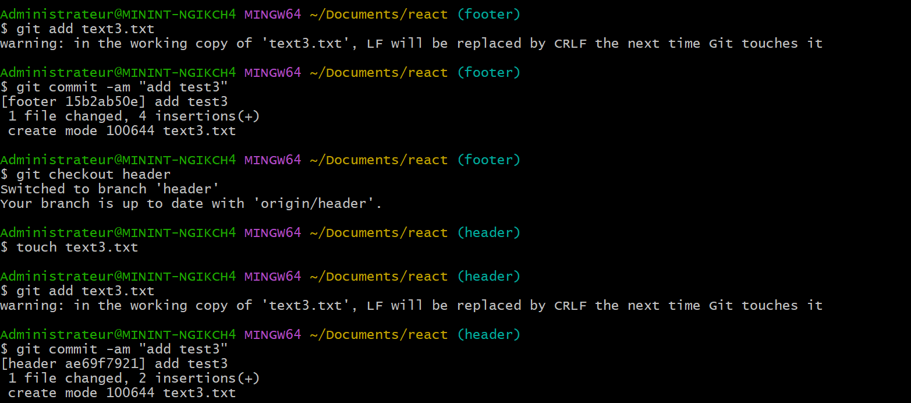

### TP 1: Introduction et Bases de Git
- **Tâche 1 :** Cloner le dépot

- **Tâche 2 :** Analyse des commits

- **Tâche 3 :** Modification du README

### TP 2: Bonnes Pratiques de Codage
- **Tâche 1 :** Analyser les commits : 
Les commits sont clairs et présentent tous la mention d'une action (add, remove, update, fix, merge)
- **Tâche 2 :** Identifier des exemples de bonnes pratiques de codage dans le code source :  
?

### TP 3: Utilisation Avancée de Git
- **Tâche 1 :** Créer des branches pour des fonctionnalités hypothétiques, fusionner ces branches.  
J' ai créé 2 branches (header, footer) et chacune d'elle contenait un document texte.
J'ai merge header sur footer, maintenant header contient le document texte de footer en plus.

- **Tâche 2 :** Simuler un conflit de merge et le résoudre.  
J'ai créé un fichier text3.txt dans les branches header et footer avec un contenu différent

Lors du commit il y a une erreur dûe à un conflit

Dans l'IDE, l'éditeur de conflit apparaît et invite à prendre une décision

En choisissant l'option voulue, on confirme le merge puis on commit : le conflit est résolu.

### TP 4: Revue de Code et Collaboration
- **Tâche 1 :** Examiner les pull requests ouvertes et fermées pour comprendre comment la revue de code est gérée.
